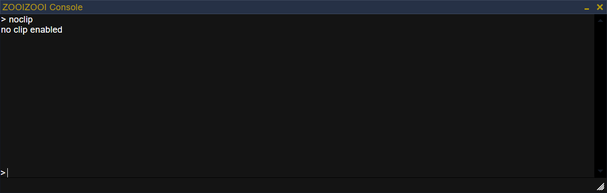

# Consola
In viewport console to execute commands and log output



### Setup
```bash
# ni
ni @zooizooi/consola

# npm
npm install @zooizooi/consola

# pnpm
pnpm add @zooizooi/consola
```

### Use
```js
// Import
import Consola from '@zooizooi/consola';

// Init
const consola = new Consola();

// Command example
function noclip() {
    consola.showMessage('no clip enabled');
}
consola.addCommand('noclip', 'Fly through walls!', noclip);
```